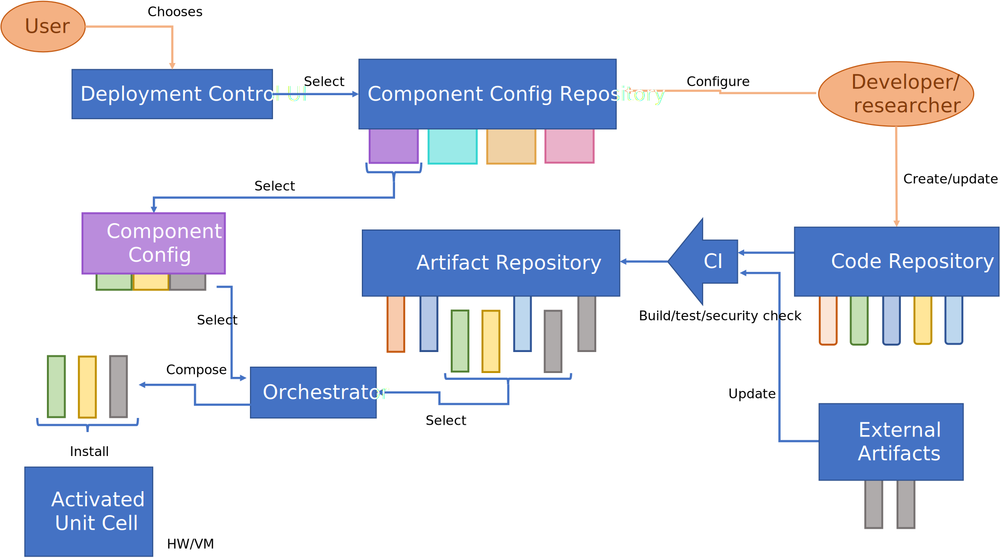
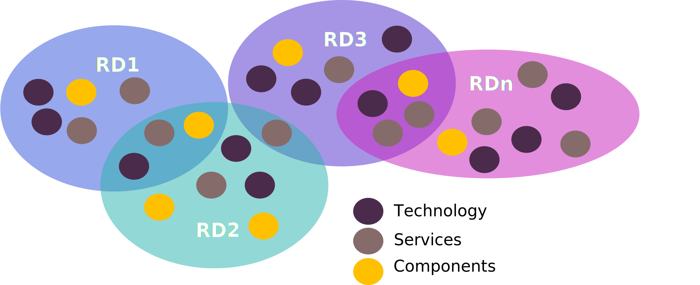
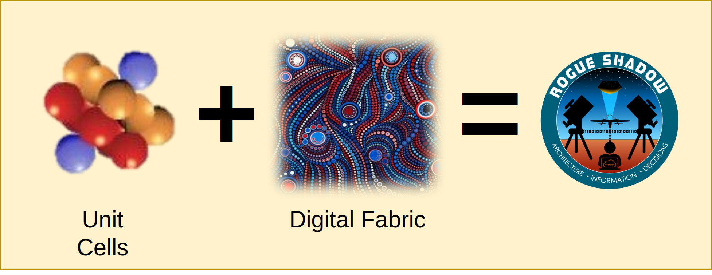

# Integrated Centre Overview

[[_TOC_]]

## Introduction

> The Integrated Centre is a Strategy

The Agile C2 STaR Shot Campaign Plan defines an Integration Strategy to deliver the Capability
Outcomes. 

## Realisation of the Strategy

Latin

### Best Practice and Latest Technology

Latin 

The key practices and technologies are listed below but described in detail in [Integrated Centre Technology Strategy](integrated_centre_technology_strategy.md)

### Refactory

Refactory is the system that utilises and provides the technologies described in the Integrated Centre Technologies<!--[Integrated Centre Technologies](../integrated_centre_technologies.md)-->
document. 

#### Refactory General Principles

#### Aspirational System Operational Flow

The technical detail of this system is outlined in the [Refactory Repository](https://refactory.australiacentral.cloudapp.azure.com/integrated-centre/refactory).

### Reference Deployments

### Rogue Shadow

Refer to the [Rogue Shadow Technical Description](rogue_shadow/rogue_shadow_technical_description.md) for further
detail.

