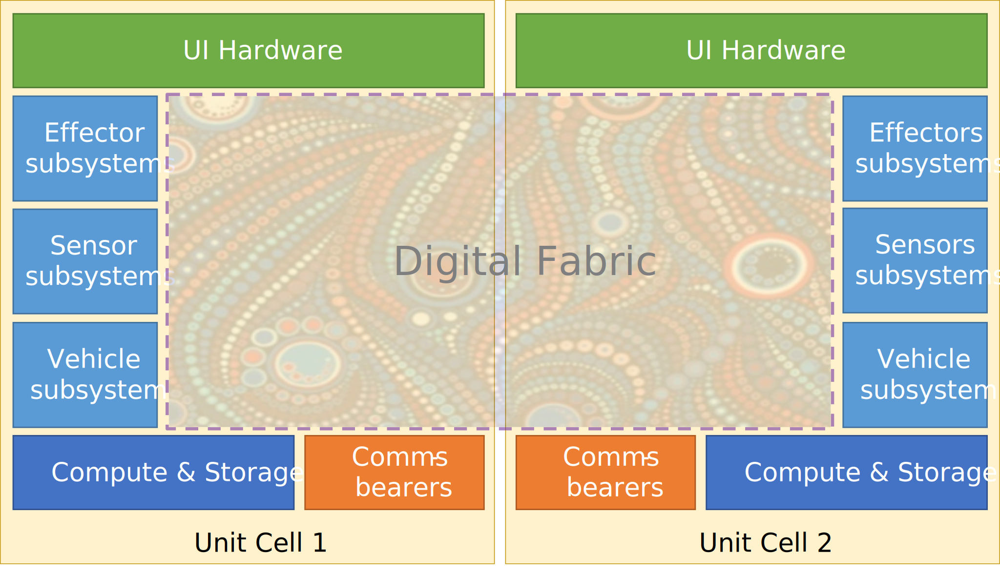
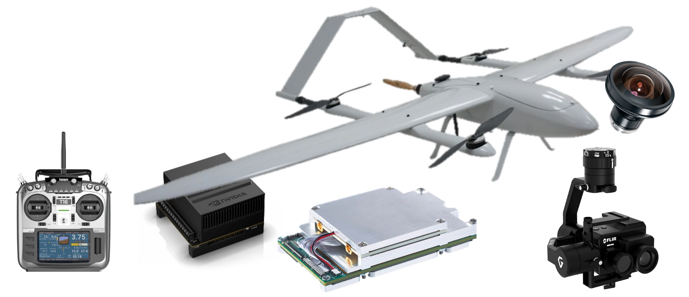
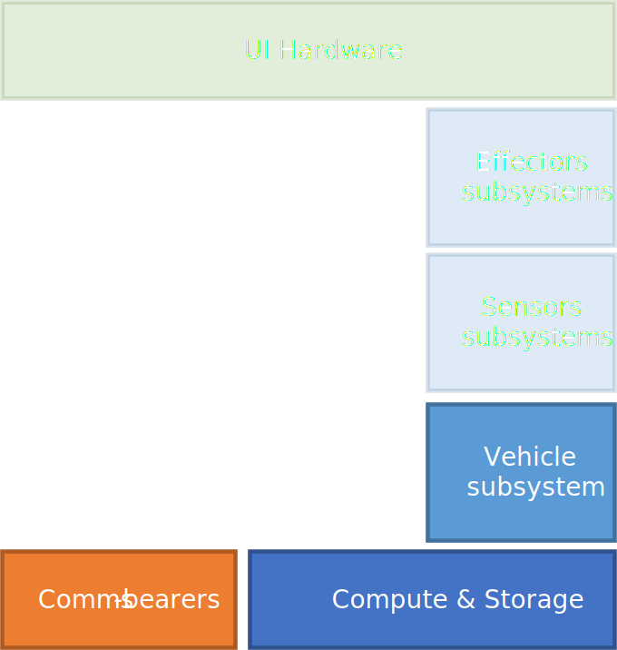
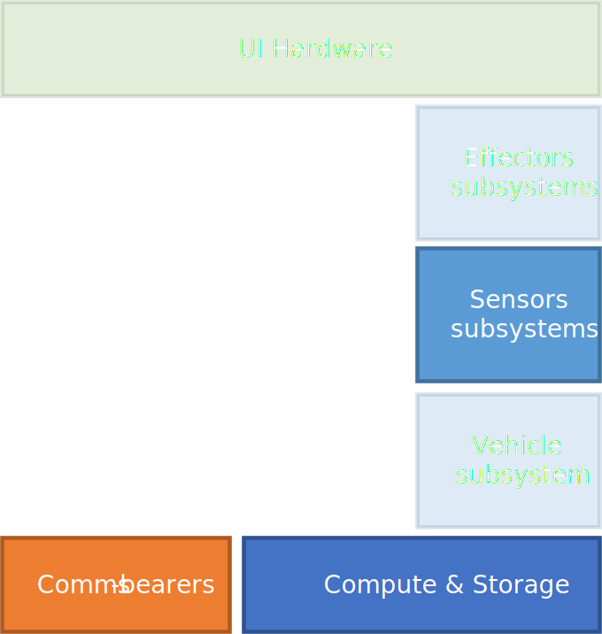
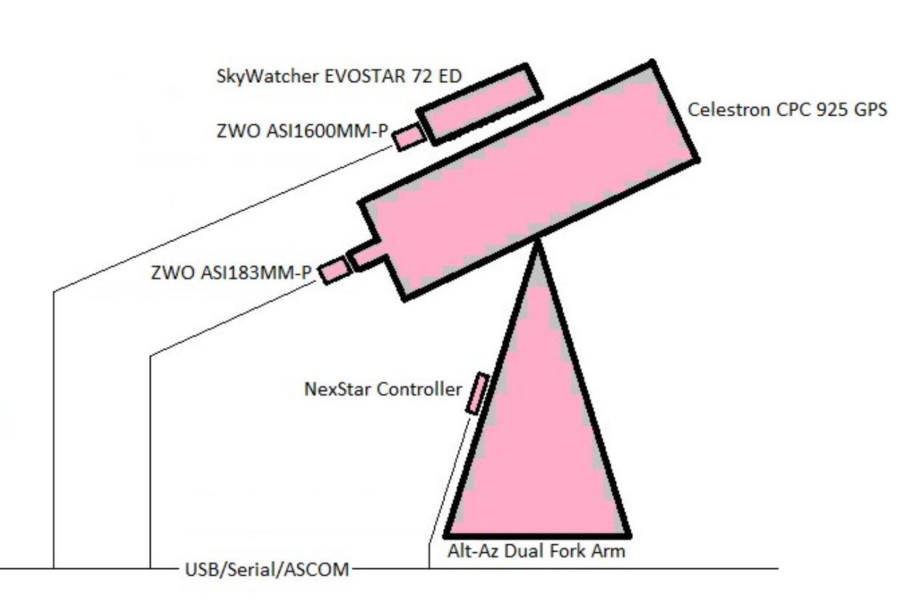

# Rogue Shadow Unit Cells Detailed Design

[[_TOC_]]

## Introduction

## Comms Design

Latin

## Unit Cells

### Baby Sharks

#### UAV Hardware {#uav-hardware}

### DeltaQuads

#### UAV Hardware<!--[UAV Hardware](#uav-hardware)-->

### Telescopes

Latin

### Telescope Schematic

[Further Details Here](https://teams.microsoft.com/l/file/8DFE1E06-C884-442F-98D7-F4238012F070?tenantId=e99d2042-c1e3-4d13-a60e-20d3bb39177c&fileType=pptx&objectUrl=https%3A%2F%2Fgovteams.sharepoint.com%2Fsites%2Fdstwcsdintcombatcloud%2FShared%20Documents%2FRogue%20Shadow%20(Networked%20Telescope%20Testbed)%2FRogue%20Shadow%20Astronomical%20Infrastructure.pptx&baseUrl=https%3A%2F%2Fgovteams.sharepoint.com%2Fsites%2Fdstwcsdintcombatcloud&serviceName=teams&threadId=19:689825a1aaf8430b8e229cbda7b032eb@thread.tacv2&groupId=859614e7-9b65-4f56-b947-a1c841ccd6be)

